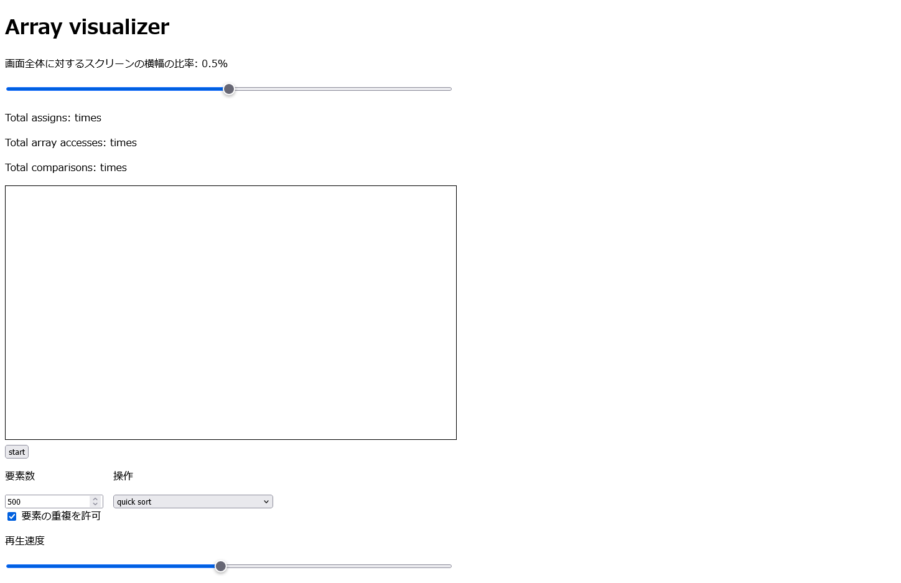

<!-- 本スライドはmarpを利用して生成しました。marpをインストールして、marp presentation --html で変換できるはずです。 -->

# Array visualizerの紹介
---

## 作成動機 + 動作紹介

---

こういう動画、見たことありますか？

<iframe width="560" height="315" src="https://www.youtube.com/embed/kPRA0W1kECg?si=PC1lpbX79T_I5pWI" title="YouTube video player" frameborder="0" allow="accelerometer; autoplay; clipboard-write; encrypted-media; gyroscope; picture-in-picture; web-share" referrerpolicy="strict-origin-when-cross-origin" allowfullscreen></iframe>

link: [https://www.youtube.com/watch?v=kPRA0W1kECg](https://www.youtube.com/watch?v=kPRA0W1kECg)

---

<p style="font-size: 3rem;">あの動画を手元で再現したい！！！</p>
<p style="font-size: 10rem;">&#x1f525;&#x1f525;&#x1f525;</p>

---

<p style="font-size: 3rem">HTML + javascriptで(ある程度)再現しました。</p>

github pagesを用いて公開しています。
良かったら遊んでみてね。

[https://inthebloom.github.io/array-visualizer/](https://inthebloom.github.io/array-visualizer/)

(gitわからん人類なので、プルリクとかもらっても対応できないかも。助けてください。)
(commitが下手すぎるので見ないでください。)

---

### 機能一覧&#x1f601;&#x1f601;&#x1f601;
- ビジュアライズの枠の大きさの設定(再生中でも変更可能！)
- 再生速度の設定(再生中でも変更可能！)
- 配列への総アクセス数、配列への総代入回数、総比較回数を視覚化
- 配列の要素数を自由に設定可能(デカすぎると動きません)
- 要素が重複する配列を生成可能
- いくつかのソートアルゴリズムを実装済み

---

### 発表に間に合わなかった機能&#x1f62d;&#x1f62d;&#x1f62d;
- ユーザー定義コードをevalとかで動かすやつ
- 音を出す機能
- なんか見た目をいい感じにする
- シークバーの実装(これは技術的に厳しそう)

---

### 外見 (画像)


---

### デモ1 (Quick Sort)
<video src="source/demo_quicksort.mp4" height="500" controls></video>

---

### デモ2 (Selection Sort)
<video src="source/demo_selectionsort.mp4" height="500" controls></video>

---

## 技術的な解説

---

### どうやって実現しているか？
流れとしては、
1. 目標となる配列を生成し、実際にソートを行う。ソートを行う途中で発生した配列アクセスなどは逐次別の配列に記録して保持しておく。
2. startボタンが押されたら、前計算した情報に基づいて画面描画を逐次計算する。

という感じです。

---
### 前計算パート
`type`、`index`、`value`、`color`というフィールドを持つObjectの配列を用いました。

前計算はこんな感じで行います。
```javascript
this.operations.push({
    type: OPERATION_TYPE.ASSIGN,
    index: i,
    value: val,
    color: OPERATION_COLOR.ASSIGN,
});
```
---
### 描画パート

HTMLにはcanvas animationというものがあります。
[基本的なアニメーション - Web API | MDN](https://developer.mozilla.org/ja/docs/Web/API/Canvas_API/Tutorial/Basic_animations)

例えば、こういう感じで長方形領域を塗ることができます。(`fillRect`はピクセル指定です)
```javascript
const ctx = getElementById("screen").getContext("2d");
ctx.fillRect(x1, y1, x2, y2);
```
---

実際のコードはこんな感じ
```javascript
// スクリーン描画
for (let i = 0; i < N; i++) {
    ctx.fillStyle = this.tracking_array.current_color[i];
    ctx.fillRect(10 + i * rectangle_width,
            h - rectangle_unit_height * this.tracking_array.current_array[i],
            rectangle_width,
            h);
}
```

---
後は気合を入れてコーディングします。
&rarr;何とか見せられる形に持っていけました。&#x1f624;&#x1f624;&#x1f624;

生jsでcanvasお絵描きは結構やりごたえがあって面白いと思います。
是非挑戦してみてください！

---
## 最後に

githubから全ソースコード及びこのスライドにアクセスできます。
[https://github.com/InTheBloom/array-visualizer](https://github.com/InTheBloom/array-visualizer)
ソースコードはCC0で公開しているので、煮るなり焼くなりしてOKです。

---

<p style="font-size: 4em;">ご清聴ありがとうございました！&#x1f61a;</p>
